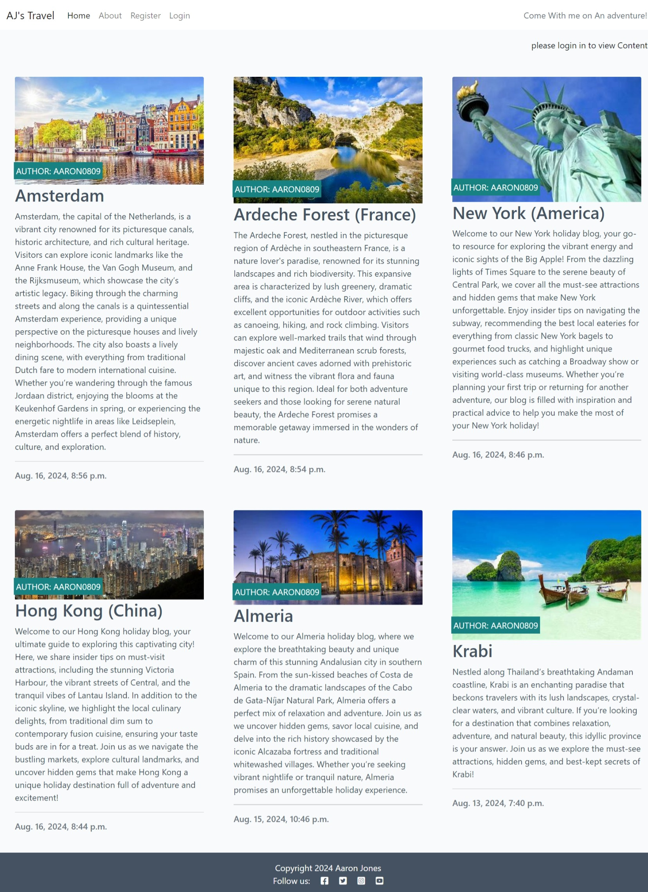

# Aj Travel Blog

AJ's Travel Blog is A site that hosts The content creator AJ can keep all of his holiay blogs to recommend great places around the world to all users who are looking for their next travel destination, It is targeted for people looking for a holidy but not sure where to go.

## Features 

- __Heading__

  - Navigation bar includes links to the Logo, Home page, About Page, Register page, login Page.
  - This section will allow the user to easily navigate from page to page across all devices without having to revert back to the previous page via the ‘back’ button. 

- __Post Detail Page__

  - Gives more information about the Post and gives users who are logged in the option to post a comment regarding the post, that goes to the creator of the post to navigation bar includes links to the Logo, Home page, About Page, Register page, login Page. 
  - This section gives the user to an eye catching display with phtot of the area of the blog to grab their attention.

- __About Page__

  - Gives Users the chance to see who the author of the blog is and also give the chance to collaborate with the User to add more posts and co-author. 

- __Register Page__

  - This section will allow the user to register for an account so that they can post comments and request to co-author a blog post.
  - This section was made by using django forms. 

### Features Left to Implement

- Links To Social Media Pages.
- Add ability to add posts from the blog page.

### Validator Testing 

- HTML
  - No errors were returned when passing through the official [W3C validator]()
- CSS
  - No errors were found when passing through the official [(Jigsaw) validator]()

The live link can be found here - https://project-blog-92b414fbb7f1.herokuapp.com/

## Credits 

Code Idea followed by the I think therefore I Blog Code found on Code Institute Website. 

### Content 

- The icons in the footer were taken from [Font Awesome](https://fontawesome.com/)

### Media

- The photos used are from These sites
